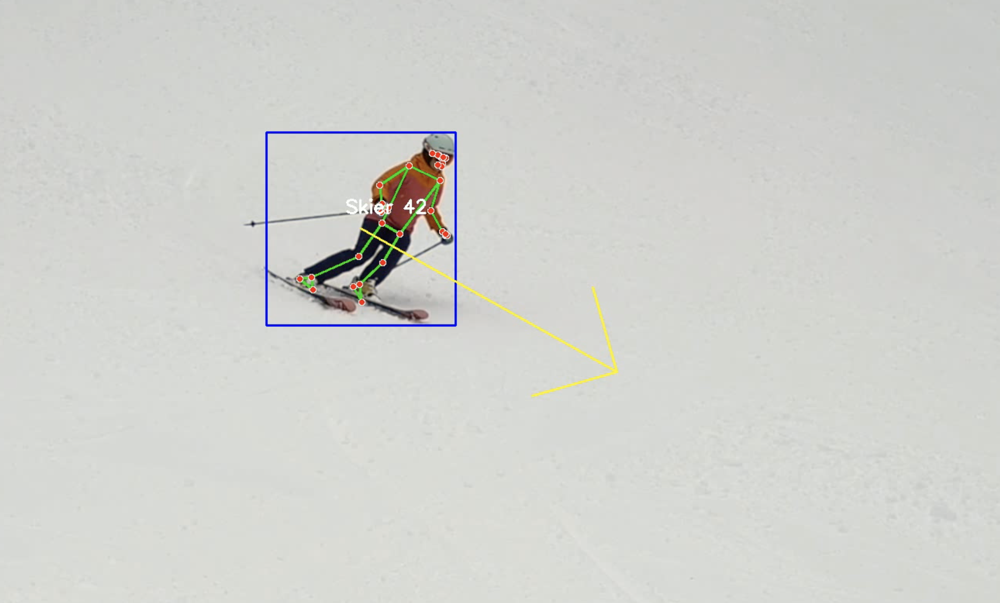

# SkiVision 🎿👀  
**Tracking skiers with computer vision using OpenCV, MediaPipe, and DeepSORT**  





## 📌 Overview  
SkiVision is a computer vision project that detects and tracks skiers in a video using object tracking and posture estimation. It provides:  
- **Object tracking:** Using DeepSORT or CentroidTracker  
- **Posture estimation:** Using MediaPipe Pose  
- **Direction & speed visualization:** Arrows indicating movement over multiple frames  
- **Noise filtering:** Removes detections in unwanted areas  

---

## 🛠️ Installation  
Ensure you are using a Python virtual environment. Run:  

```sh
python3 -m venv venv
source venv/bin/activate  # On macOS/Linux
venv\Scripts\activate  # On Windows
pip install -r requirements.txt
```

---

## 🎥 Usage  
### **Run tracking & posture estimation with CentroidTracker**  
```sh
python skivision.py
```
### **Run tracking with DeepSORT for more robust tracking**  
```sh
python video_deepsort_pose.py
```

Both scripts will process the video and output a new version with tracking, posture estimation, and movement visualization.

---

## 🎯 Features  
✔ **Real-time object tracking**  
✔ **Posture estimation with MediaPipe**  
✔ **Direction & speed visualization with arrows**  
✔ **Noise filtering to remove false detections**  

---

## 📌 Notes  
- Place your input videos in the `video/` folder before running scripts.  
- The output videos will be saved in the same folder with `_pose` or `_deepsort_pose` added to the filename.  
- For improved tracking accuracy, use `video_deepsort_pose.py` instead of `skivision.py`.  

---

## 🏔️ Author  
[Your Name] - Created for skier tracking experiments.  
Feel free to contribute and improve the project! 🚀  
